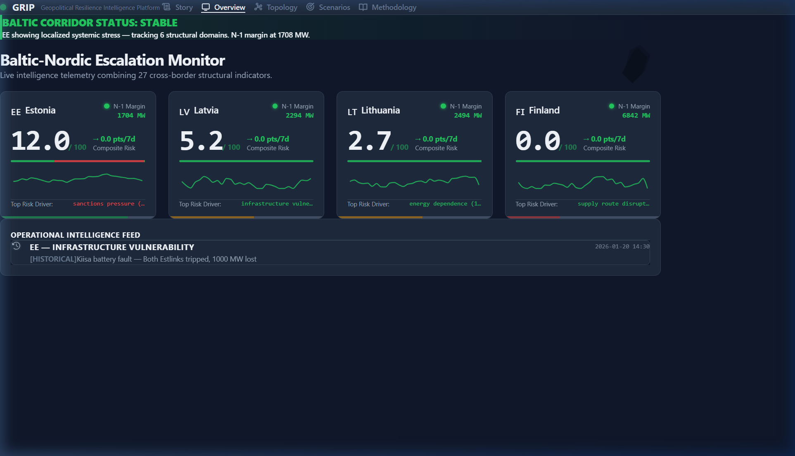
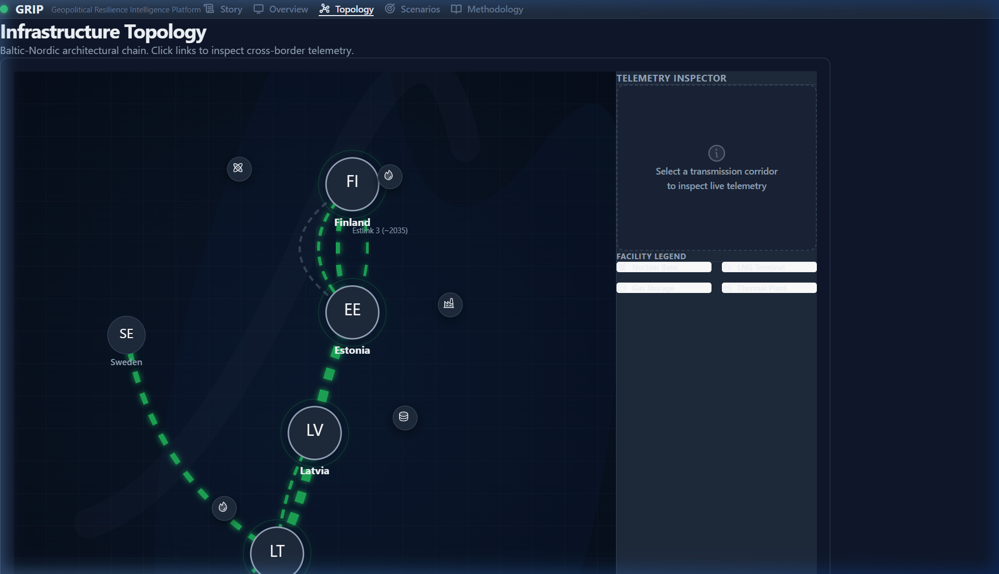
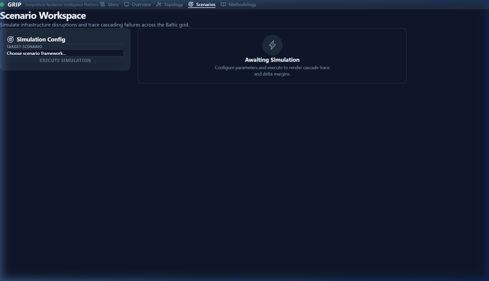
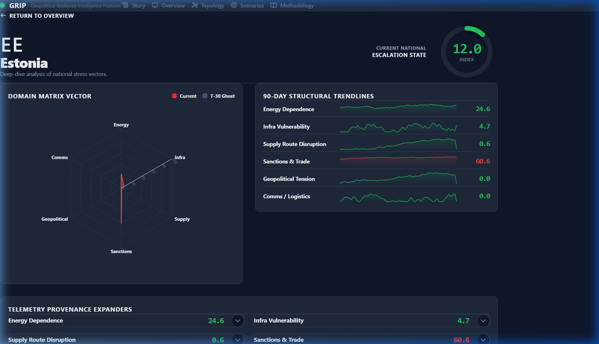
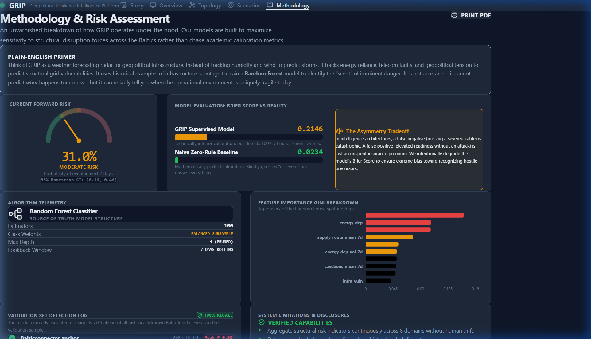

# GRIP — Geopolitical Resilience Intelligence Platform

> Baltic-Nordic energy corridor risk analytics.
> Monitoring · Simulation · Forecasting · Decision Support



## The Problem

The Baltic energy corridor is a serial chain connecting Finland, Estonia,
Latvia, and Lithuania. After desynchronizing from Russia's power grid in
February 2025, the system operates with minimal redundancy. 12 infrastructure
disruptions in 4 years — including deliberate cable severances by shadow fleet
vessels — have exposed critical vulnerabilities.

GRIP monitors this corridor, scores risk across 8 domains, simulates
infrastructure failure cascades, and produces calibrated disruption-probability
estimates.

## What It Does

| Capability | Description |
|---|---|
| **Live Monitoring** | 27 indicators across 8 risk domains, scored daily |
| **Infrastructure Mapping** | Physical topology with capacity, status, and vulnerability data |
| **Scenario Simulation** | What-if analysis: remove cables, simulate attacks, see cascade consequences |
| **Risk Forecasting** | 30-day disruption probability with confidence intervals |
| **Validation** | Backtested against 12 real events. 6/6 energy disruptions detected. |

## Screenshots

### Global Overview

*Four Baltic states ranked by composite risk. Threat banner, N-1 margins, trend indicators.*

### Infrastructure Topology

*Physical network with submarine cables, pipelines, LNG terminals, and power plants.*

### Scenario Workspace

*Estlink 2 severance scenario showing cascade impact on Estonian grid margins.*

### Country Detail

*Estonia risk profile: 8-domain radar, sparklines, indicator provenance.*

### Methodology & Risk

*Risk gauge, Brier score comparison, feature importance, claim boundaries.*

## Quick Start

### Prerequisites
- Python 3.11+
- Node.js 18+
- Docker (optional, for PostgreSQL — SQLite works for demo)

### Setup
```bash
git clone https://github.com/gavinshklanka/grip.git
cd grip
cp .env.example .env
pip install -e ".[dev]"
python -m backend.db.seed

# Terminal 1: Backend
uvicorn backend.main:app --reload

# Terminal 2: Frontend
cd frontend && npm install && npm run dev
```

Open http://localhost:5173 → Start at the Story page for a guided tour.

## Architecture

```
Ingestion (ENTSO-E, ENTSOG, GDELT, ...)
    → Scoring Engine (8 domains, config-driven weights)
    → Simulation Engine (capacity arithmetic on physical topology)
    → Forecasting Engine (Random Forest + rule-based alerts)
    → FastAPI (REST endpoints, Pydantic validation)
    → React Dashboard (5 views + narrative story page)
```

## Key Design Decisions

- **One region, done well.** Baltic-Nordic corridor only. Depth over breadth.
- **Topology is the model.** The dependency graph is physical infrastructure, not statistical co-movement.
- **Config over code.** Weights, thresholds, scenarios in JSON — not hardcoded.
- **Honest validation.** Brier score reported even when unfavorable. 7 limitations documented.
- **Forecasts ≠ scenarios.** Separate code paths, separate API routes, separate views.

## Backtest Results

| Event | Date | Peak Risk | Detected? |
|---|---|---|---|
| Balticconnector anchor damage | 2023-10-08 | 0.59 | ✓ |
| Estlink 2 technical fault | 2024-01-26 | 0.58 | ✓ |
| NordBalt suspected damage | 2024-11-17 | 0.67 | ✓ |
| Eagle S Estlink 2 severance | 2024-12-25 | 0.65 | ✓ |
| Estlink 1 outage | 2025-09-01 | 0.60 | ✓ |
| Kiisa battery fault | 2026-01-20 | 0.61 | ✓ |

## Tech Stack

FastAPI · PostgreSQL/SQLite · pandas · scikit-learn · NetworkX · React · Vite · Tailwind · Recharts · framer-motion

## Documentation

- [Governance Stack](docs/governance/) — 6-document specification hierarchy
- [Methodology](docs/methodology.md) — Scoring methodology with worked examples
- [Backtesting Report](docs/backtesting-report.md) — Model validation narrative
- [Limitations](docs/limitations.md) — 8 specific, quantified limitations
- [Canada-Baltic Opportunity Brief](docs/strategic/canada-baltic-opportunity-brief.md) — Strategic companion

## Built By

**Gavin Shklanka** · MBAN 2026 · Sobey School of Business · Saint Mary's University  
Black Point Analytics

---

*GRIP does not predict wars, recommend military actions, or claim operational intelligence capability. It models consequences, dependencies, and fragilities using open-source data with documented methodology.*
